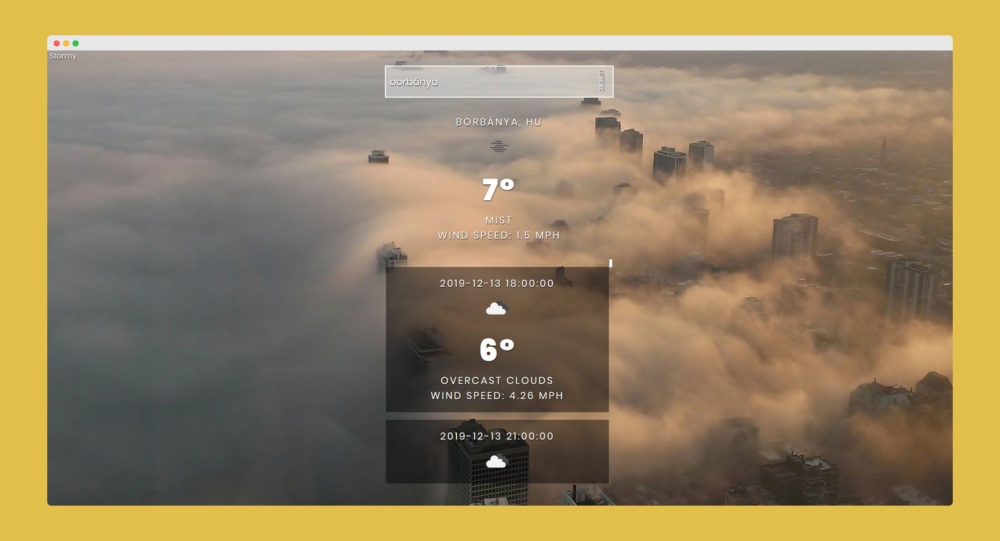

# Stormy

## [Check live demo!](https://stormy-mf.netlify.com)

Stormy is a weather and forecast app which is using the Weather API by OpenWeatherMap.

## How to Use

Type a valid city name in the search field then hit enter or click the submit button.

## Built With

- ReactJS (Hooks)
- Weather API
